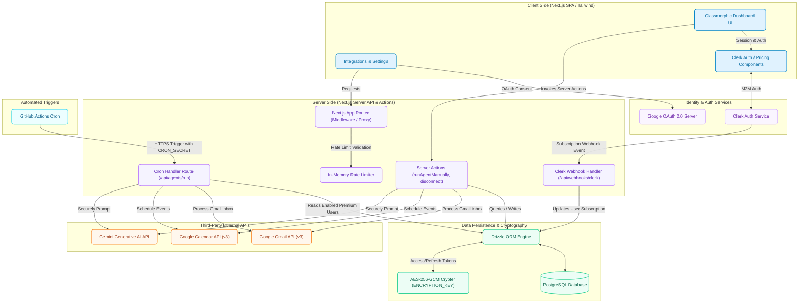
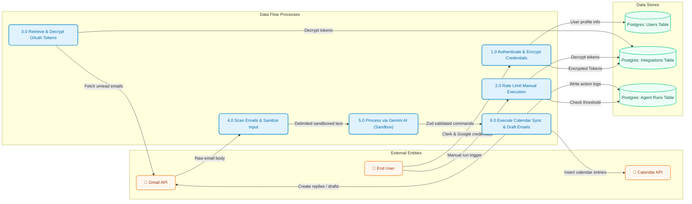
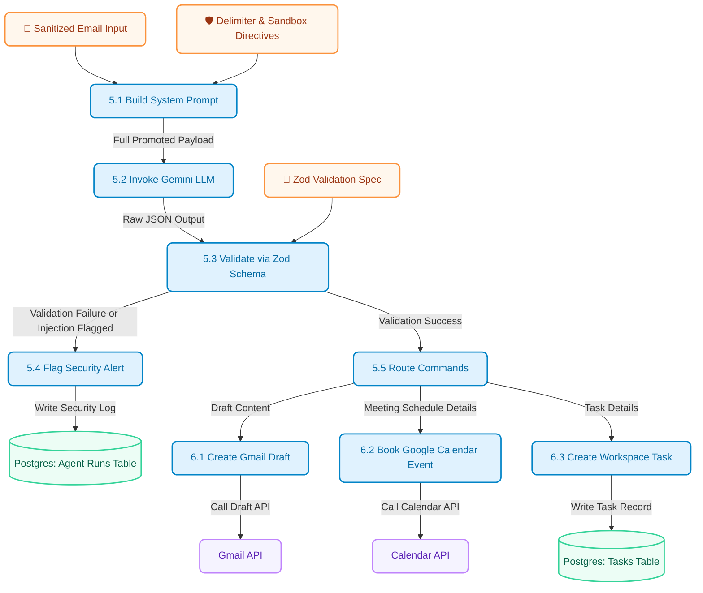

<p align="center">
  
</p>

# Operyn

> [!NOTE]
> For a detailed architectural breakdown of non-functional requirements, performance engineering, cost optimizations, and security hardening, check out the [System Design & Engineering Decisions Guide](./SYSTEM_DESIGN.md).

> [!WARNING]
> **Google OAuth Integration Notice**: The Google Workspace OAuth integration is currently running in **Developer Testing Mode** in compliance with Google API Verification policies. To test the live integration, you can either run the application locally by supplying your own client credentials (see Local Setup), or contact me directly to have your Google account whitelisted on the Google Cloud Console.

**Operyn** is an autonomous AI Executive Assistant designed to manage daily workspace workflows in the background. It securely connects to your Google Workspace, analyzes incoming items using generative models, schedules tasks, drafts context-aware email replies, and manages calendar events automatically.

---

## 🚀 Key Features

*   **Autonomous Background Worker**: Periodically polls and executes agent tasks securely without manual intervention.
*   **Google OAuth Integration**: Connects dynamically to Gmail and Google Calendar to scan mailboxes, check conflicts, and insert meetings.
*   **Interactive Task Manager**: A dedicated workspace tab showing AI-extracted tasks, allowing filtering (Pending, Completed, All) and sorting (Due Date, Priority, Date Created) with **Optimistic UI Updates** that run with zero perceived latency.
*   **Live Calendar Sync Agenda**: A real-time timeline displaying upcoming events queried directly from the user's Google Calendar with customized tags highlighting slots scheduled by the AI.
*   **Robust Security & AES-256-GCM**: Persists all third-party OAuth access/refresh tokens in PostgreSQL using enterprise-grade AES-256-GCM encryption.
*   **Prompt Injection Protection**: Employs sandboxed `<email_body>` delimiters and strict system-level model guardrails to prevent indirect prompt injections.
*   **Clerk Billing & Webhooks Synchronization**: Real-time webhook integration to sync Clerk subscriptions (`active`, `past_due`, `canceled`) to the Postgres database.
*   **GitHub Actions Cron Automation**: Runs GitHub Actions workflow schedules to securely trigger background agent runs for premium subscribers every 15 minutes.
*   **Rate-Limiting Protection**: Restricts manual agent runs to 3 executions per 10 minutes to protect API quotas.
*   **Performance Cache Memoization**: Integrates React's `cache` query memoization and concurrent `Promise.all` fetch routines to render views instantly.

---

## 🛠️ Tech Stack

*   **Framework**: Next.js 15 (App Router)
*   **Language**: TypeScript
*   **Database & ORM**: PostgreSQL (Railway) + Drizzle ORM
*   **Authentication**: Clerk Authentication
*   **Integrations**: Google APIs Client (Gmail & Calendar v3)
*   **AI Engine**: Google Gen AI API (via Vercel AI SDK)
*   **Styling**: Tailwind CSS + Radix UI + Lucide Icons

---

## 📂 Project Architecture & Data Flows

### 1. System Architecture Diagram
This diagram illustrates the physical and logical layout of the Operyn platform, mapping client interactions, middleware limits, auth checks, persistent storage lookup, token decryption, background schedulers, and external API requests:



### 2. Data Flow Diagram (DFD Level 1)
This Data Flow Diagram tracks the movement of information across the boundaries between external entities, background processes, security modules, database layers, and final destinations:



### 3. Data Flow Diagram (DFD Level 2 - AI Processing Pipeline)
This Level 2 DFD decomposes **Process 5.0 (Process via Gemini AI)** to illustrate the detailed data routing, sandboxing validation, prompt construction, security checks, and Zod command parser schema execution:



---

## ⚙️ Environment Configuration

Create a `.env.local` file in the root directory and configure the following variables:

```env
# Clerk Authentication Configuration
NEXT_PUBLIC_CLERK_PUBLISHABLE_KEY=pk_test_...
CLERK_SECRET_KEY=sk_test_...
NEXT_PUBLIC_CLERK_SIGN_IN_URL=/sign-in
NEXT_PUBLIC_CLERK_SIGN_UP_URL=/sign-up
NEXT_PUBLIC_CLERK_SIGN_IN_FALLBACK_REDIRECT_URL=/
NEXT_PUBLIC_CLERK_SIGN_UP_FALLBACK_REDIRECT_URL=/

# Clerk Webhook Signing Secret (from Clerk Dashboard -> Webhooks)
CLERK_WEBHOOK_SIGNING_SECRET=whsec_...

# Google OAuth Credentials
GOOGLE_CLIENT_ID=507684642745-gi3814koemlbi9k80l7j8oonn4oq13dq.apps.googleusercontent.com
GOOGLE_CLIENT_SECRET=GOCSPX-...
NEXT_PUBLIC_APP_URL=http://localhost:3000

# Database Connection (Railway / PostgreSQL)
DATABASE_URL=postgresql://postgres:...

# Cryptographic Keys (Must be 64-hex characters / 32-bytes)
ENCRYPTION_KEY=e1d4170f....

# Google Gemini API Key
GOOGLE_GENERATIVE_AI_API_KEY=AIzaSy...

# Machine-to-Machine Background Cron Token
CRON_SECRET=b6d3a66.....
```

---

## 🏃 Getting Started

### 1. Install Dependencies
```bash
bun install
```

### 2. Prepare Database Schema
Push the Drizzle schemas to your live Postgres database instance:
```bash
bunx drizzle-kit push
```

### 3. Run the Development Server
```bash
bun dev
```
Open [http://localhost:3000](http://localhost:3000) with your browser to view the application.
